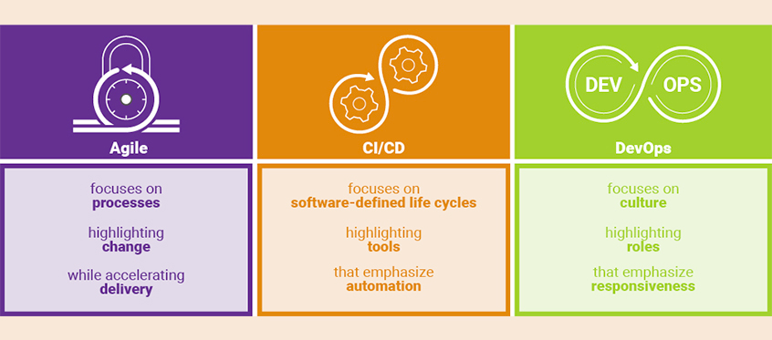

- 工作中遇到了什么复杂的业务场景，解决方法？
- 工作中遇到了什么技术性的难题，怎么解决的？
- 工作中遇到了什么复杂的bug，怎么解决的？
- 工作中有没有遇到什么性能的问题，怎么解决的？（性能问题的排查流程）
- 工作中的一些有成就感的事情。
- 设计模式在业务中的使用
- 多线程在业务中的使用。线程池怎么用的，结合具体业务
- 服务响应慢，如何排查
- 慢SQL优化、JVM调优
- 方法运行时的出栈与入栈
- Spring Cloud在业务中的使用
- 看过Redis、RabbitMQ的源码吗？
- 容器/并发容器，有比较了解的吗，具体聊聊。
- 生产环境，CPU占用过高，分析及定位
- safepoint是什么
- invokedynamic指令是干什么的
- 假如 Redis 里面有 1 亿个 key，其中有 10w 个 key 是以某个固定的已知的前缀开头的，如何将它们全部 找出来? 可以使用keys，但会阻塞，也可使用scan，但会重复，看业务场景。
- 线上FullGC卡顿性能优化
- 线上OOM内存溢出问题
- 平时有些思考，若请求量增加1百倍，1万倍，现有的服务架构要如何演变；
- [系统性能分析入门](https://mp.weixin.qq.com/s/beqzPadduGPSn6hw7oF4EQ)
- 系统设计：设计一个短链接生成系统
- [十大经典系统设计题](https://xie.infoq.cn/article/4c0c9328a725a76922f6547ad)
- 接口权限、数据权限模型如何设计，具体功能如何实现
- [反向面试](https://github.com/yifeikong/reverse-interview-zh)
- DDD了解吗
- DevOps、CI/CD、Agile有啥吗联系及区别
    - 区分敏捷，DevOps 和 CI/CD 最快速简便的方法：
    - 敏捷专注于在加速交付的同时突出变化的过程。
    - CI/CD 专注于软件生命周期内强调自动化的工具。持续集成（CI）、持续交付（CD）
    - DevOps 专注于强调响应能力的文化角色。
      
- 单元测试、代码覆盖率

。。。。。

- 职业发展，短期、长期。学习方法。
- 如果你本身工作没有技术挑战，那么尽可能多给自己设立一些挑战，多学一些技术，多做一些尝试和实践。

。。。。。

- 微博的动态推送怎么实现
    - 推模式（消息拷贝到关注侧）和拉模式（消息保存在发起侧，需主动拉取）。
    - 普通的应该是推模式。大V才有拉模式，具体记不清拉。
- 购票系统如何避免超卖
    - 1000张票，10个实例集群，可以每个集群分120张（放入Redis），考虑到流量分布可能不均匀，为了避免少卖，每份可以比100多一点，但超卖问题也要考虑解决。
    - 异步、MQ削峰
    - Redis瓶颈：将票分开放，比如120张票，可以分成4份（不同的key：p_1，p_2，p_3，p_4），每份30张，这4份很可能就在不同的槽中，从而落在集群中不同的节点上
    - 上面这俩实际上就是数据分区，在一些分布式锁的场景，也可以通过分段加锁的方式来提高并发性能：100张票，一个key的话每次只能处理一个，如果分成10份，10个key，就可以一次处理10个了，但需要注意若锁定的key余量不足，要主动释放，然后试试另一个分段够不够，依次类推
    - 针对单集群的120张不超卖，可以使用lua脚本，原子更新
    - 甚至可以在本地缓存中放些信息，从而减轻Redis的压力。比如单集群12个节点，每个节点本地缓存10张，来请求后扣减本地库存，然后返回并异步创建订单（MQ），由消费侧保证不超卖。当本地库存没了之后，可以直接返回没票。
    - 针对于全部的1000张如何避免超卖，感觉可以按上面说的。但12306不能这样搞，因为要求实时出结果，而非异步后续通知是否成功。。。
    - 最后当没票了之后，在Nginx层可直接拦掉，不让流量再抵达服务侧
    - 分流方面：
        - 一方面可以根据地区分（京东、淘宝这些商品在不同的库存是不一样的，这样就可以分成多个独立的集群）
        - 另一方面还可以从其他纬度，比如商品的类型，甚至在多个热门商品的情况下，可以把他们分到不同的节点中去
    - 上面只是之前看到的一篇文章中的，关于12306，这两篇还可以
    - [12306 外包给阿里巴巴、IBM 等大企业做是否可行](https://www.zhihu.com/question/22451397/answer/21426532)
    - [浅谈12306核心模型设计思路和架构设计](https://blog.csdn.net/huangshulang1234/article/details/78548485)
    - 现在12306采用候补 + 分批放票的模式，应该是减少了不少的复杂性。
      -
      分批、分区间放票。可以很好的解决一张票需要更新多个区间的SKU的问题，逐渐的放出中间区间的票，这样带来很大的操作空间。先放出部分大区间及少量中间区间，再逐渐的放出中间的区间，一方面这些票之间可能没太多联系（大区间与中间区间的票联系较小，更新时影响的记录也大幅减少），另一方面也实现了分流（不同区间的人员关注的时间段也不同）。
        - 预售 + 候补的机制，一方面扩展了整个区间，减轻放票节点的压力，另一方面候补的排队及偏模糊的成功率，也算是之前说的排队+抽幸运用户方案的一个优化。并且候补的量也给决策方一个此次压力的预估。
- 跨年抢红包 [19年百度春晚红包故事](https://mp.weixin.qq.com/s/W9Nbq64v9doYPxcCLBsqNQ)
- 给一个 10G 的文件，里面只有两行记录是一样的，如何找出（电脑内存只有 500M）
    - 分治法是解决此类问题的常用方式：内容hash取模。分成不同的小块，分治处理。
    - 部分情况下也可以使用位图（前提是能放下）
- 点赞系统设计
    - 系统设计：功能如何实现的问题
        - 以内容为纬度，保存总点赞数
        - 用Redis中的Set来维护点赞某个内容的用户
    - 支持高并发
        - DNS分流到不同的机房。
        - LVS/F5负载均衡到不同的Nginx，Nginx下是多个集群
        - Nginx分流到不同到集群。根据用户属性分片，使得用户尽量由固定的集群处理。
        - 虽然对于持续的高并发，MQ用途不大，但还是要的
        - Redis集群，考虑把一个热点的内容分到多个key中，从而落到不同的节点上。定时统计总数并更新到缓存，排行之类的也定时更新。
        - 甚至可以使用本地缓存，来减轻Redis侧的压力（数据先记录本地，以用户的纬度存其对内容点赞/取消的动作，然后每30S合并并更新到Redis，然后有个任务每5分钟将各集群的汇总并把最新的点赞数更新到内容上。）
        - 本地计算及聚合这块，应该是有大数据的技术支持的，即可能是直接向其系统里写，而非存本地
        - 在Key方面也可以做些优化，比如某个很热的内容，可以分成XX_1、XX_2、... XX_n多个Key，不同组的实例写不同的key，然后有任务定时汇总。甚至可以把汇总的结果也分多个Key，内容相同但把热Key进一步的分解。这些Key可以分散到集群中不同的节点，避免单节点的瓶颈
        - 考虑到地域性等因素，猜测Redis集群是需要多个的。
        - 如果能保证点赞后，只能做取消操作的话，可以参考下面的做法，本地这样缓存
        - 其他：分库分表读写分离、NoSQL数据库、搜索引擎
        - 微服务架构更多是指把系统里的公共服务抽取出来单独运维管理的思想，而SOA架构则是指一种拆分服务并使服务接口访问变得统一的架构思想，SOA架构中包含了微服务的思想。
      ```
      用户A点赞的帖子:
      帖子1 -1 
      帖子2 1 
      帖子3 1 
      帖子4 -1

      用户B点赞的帖子:
      帖子1 1 
      帖子2 -1 
      帖子5 1 
      帖子6 -1

      用户C点赞的帖子:
      帖子3 1 
      帖子4 1 
      帖子5 -1 
      帖子7 1
      ```
      然后定时合并并去掉不变的之后。这样再更新到Redis的话，其压力会小很多
      ```
      帖子6 -1
      帖子7 1
      帖子3 2
      ```
- 排行榜需要些考量，十万用户，只有前1千名有排行，后面的只有百分比，如何设计？
    - 首先，排行榜及排名百分比是定时更新的，实时性要求没那么高，可以有相关任务10分钟更新一次。结果可以拷贝到多个Key中，减少热度
    - 投票数据可以不直接进Redis，先存在本地（或单独的Redis Key避免节点故障的影响，几个节点一个Key这样），然后定时聚合到总的得票信息中
    - 前一千名可放入ZSet中，每轮更新后，记录下第一千名的分数SC，下次更新时，只有分数比这个大的才放到ZSet。更新完成后，将一千名以外的从ZSet中移除。
    - 对上一条的补充：也可以在投票时就更新，当得票数大于SC时，放入/更新ZSet，这样实时性会比较高，但会导致热Key。
        - 可以对编号取模，将其分散到不同的key中，这样应该可以直接更新Redis了。若更新后的分数大于SC，再将其放入ZSet，这样ZSet的热度会低一些，但还是很高，因为分数高的选手本身就是热的（这个再想办法解决）
    - 针对排行的百分比，引入区间的概念，区间主要有【标识、区间的范围、区间内人数（可选）、该区间前的人数】。同时有一个属性来维护总人数。则 百分比 = （该区间前的人数 + 区间内人数 ） / 总人数
        - 通常情况下，一次分数的更新主要包含的逻辑：更新分数、若还在所在区间范围则不变，若升到新的区间则更新【原区间内人数 - 1、原区间前人数 + 1、新区间内人数 + 1、若跨过了区间则各跨过的区间前人数 + 1】,这种增减可以原子操作
        - 大部分情况下都是从一个区间到下一个区间，跨区间的情况不多。区间长度不是定长，根据业务情况合理设计（比如最初的几个区间长度可以稍短一些，以解决活动前期区容易集中在少数区间的问题）。单次更新，区间不变的几率还是很大的
        - 若每次都做全量的百分比更新，虽然区间不会特别多，但也可以进行些优化（记录时间周期内区间的变化情况，只有区间内或区间后的转移到区间前，才会影响到百分比，若不考虑区间内的还可以更简单一些）
