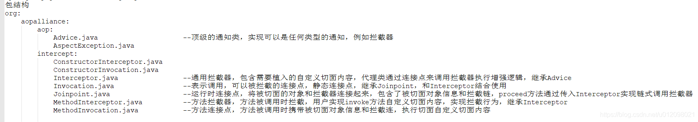

## 框架-Spring

- Spring特点：轻量级、控制反转IoC（依赖注入DI）、面向切面编程AOP、容器、框架集合

- Spring常用模块：core、beans、context、aop、mvc、tx、web、jdbc、orm

- IoC（Inverse of Control:控制反转） 是一种设计思想，而不是一个具体的技术实现。IoC 的思想就是将原本在程序中手动创建对象的控制权，交由 Spring 框架来管理。不过， IoC 并非
  Spirng 特有，在其他语言中也有应用。
    - 控制 ：指的是对象创建（实例化、管理）的权力
    - 反转 ：控制权交给外部环境（Spring 框架、IoC 容器）

  将对象之间的相互依赖关系交给 IoC 容器来管理，并由 IoC 容器完成对象的注入。这样可以很大程度上简化应用的开发，把应用从复杂的依赖关系中解放出来。 IoC
  容器就像是一个工厂一样，当我们需要创建一个对象的时候，只需要配置好配置文件/注解即可，完全不用考虑对象是如何被创建出来的。

  在 Spring 中， IoC 容器是 Spring 用来实现 IoC 的载体， IoC 容器实际上就是个 Map，Map 中存放的是各种对象。

  IoC 最常见以及最合理的实现方式叫做依赖注入（Dependency Injection，简称 DI）。

  IoC容器有BeanFactory和ApplicationContext

    - BeanFactory - BeanFactory 就像一个包含 bean 集合的工厂类。它会在客户端要求时实例化 bean。
    - ApplicationContext - ApplicationContext 接口扩展了 BeanFactory 接口。它在 BeanFactory 基础上提供了一些额外的功能。
    - BeanFactory 是 Spring 框架的基础设施，面向 Spring 本身;ApplicationContext 面向使用 Spring 框架的开发者，几乎所有的应用场合我们都直接使用 ApplicationContext
      而非底层 的 BeanFactory。

  Spring 中的 IoC 的实现原理就是工厂模式加反射机制。

- Spring如何解决循环依赖问题（singletonObjects、singletonFactories、earlySingletonObjects），
  [详见](https://www.lwohvye.com/2021/11/29/spring%e5%be%aa%e7%8e%af%e4%be%9d%e8%b5%96%ef%bc%88%e8%bd%ac%ef%bc%89/)

  AB循环依赖问题只要A的注入方式是setter且singleton ，就不会有循环依赖问题。不要用构造注入，因为其未用三级缓存，所以无法解决循环依赖问题。

  Spring推荐构造器注入的原因在于final保证了注入的组件不可变，并且确保需要的依赖不为空，然后构造器还可以内置npe check
  logic。引入新的问题是循环依赖无法自动解决了，setter注入是可以解决循环依赖问题的，构造器注入存在循环依赖的时候会中断启动。

- ConfigurableApplicationContext 扩展于 ApplicationContext，它新增加了两个主要 的方法: refresh()和 close()，让 ApplicationContext 具有启动、刷新和关闭应用上下 文的能力

- Spring Bean作用域：singleton(单例)、prototype(原型，每次通过Spring容器获取bean时，都会新建)、request、session 和 global session

- Spring Bean的生命周期：（以下只是主要流程，有机会看看源码）

    - 实例化bean对象
    - 设置对象属性
    - 检查Aware相关接口并设置相关依赖
    - BeanPostProcessor前置处理
    - 检查是否是InitializingBean以决定是否调用afterPropertiesSet方法
    - 检查是否配置有自定义的init-method
    - BeanPostProcessor后置处理
    - 注册必要的Destruction相关回调接口（以在destroy时回调）
    - 使用中
    - 是否实现DesposableBean接口以决定是否调用destory方法
    - 是否配置有自定义的destory方法

- 使用@PostConstruct可在Bean初始化完成后插入些逻辑。使用@PreDestory可在Bean销毁前插入些逻辑。

- Spring依赖注入四种方式：构造器注入、setter方法注入、静态工厂注入、实例工厂注入

- Spring自动装配的不同模式：no（默认）、byName、byType、构造函数、autodetect
- @Autowired 由Spring提供，只按照byType注入; @Resource 由J2EE(JDK的，不与Spring耦合)提供，默认按照byName自动注入，名称可以通过@Resource的name属性指定，
  如果没有指定name属性，当注解标注在字段上，即默认取字段的名称作为bean名称寻找依赖对象，当注解标注在属性的setter方法上，即默认取属性名作为bean名称寻找依赖对象，
  除了name属性外，还有type属性，可配置其中一个或都配置，按照配置的策略查找注入

- AOP(Aspect-Oriented Programming:面向切面编程)能够将那些与业务无关，却为业务模块所共同调用的逻辑或责任（例如事务处理、日志管理、权限控制等）封装起来，便于减少系统的重复代码，降低模块间的耦合度，并有利于未来的可拓展性和可维护性。

  AOP 是 OOP（面向对象编程）的一种延续。

  Spring AOP 就是基于动态代理的，如果要代理的对象，实现了某个接口，那么 Spring AOP 会使用 **JDK Proxy**，去创建代理对象，而对于没有实现接口的对象，就无法使用 JDK
  Proxy 去进行代理了，这时候 Spring AOP 会使用 **Cglib**
  生成一个被代理对象的子类来作为代理。

  AOP 主要用来解决：在不改变原有业务逻辑的情况下，增强横切逻辑代码，根本上解耦合，避免横切逻辑代码重复。

  AOP中的基本单元是Aspect（切面）

  AOP的那些个概念，可以再回顾一下：切面、连接点、切入点、引入、目标对象、AOP代理、织入、通知

  
  SpringAOP核心概念:上述中已经出现的关键词有Advice(顶级的通知类/拦截器)、MethodInvocation(方法连接点)、MethodInterceptor(方法拦截器)

  SpringAOP在此基础上又增加了几个类，丰富了AOP定义及使用概念，包括
    - Advisor：包含通知(拦截器)，Spring内部使用的AOP顶级接口，还需要包含一个aop适用判断的过滤器，考虑到通用性，过滤规则由其子接口定义，例如IntroductionAdvisor和PointcutAdvisor，过滤器用于判断bean是否需要被代理。
      Advisor是一个接口，代表被拦截的方法需要增强的逻辑，通常由另两个组件组成---Advice接口和Pointcut接口，Advice表示实际增强的逻辑入口，Pointcut表示哪些类或方法需要被拦截。
    - Pointcut: 切点，属于过滤器的一种实现，匹配过滤哪些类哪些方法需要被切面处理，包含一个ClassFilter和一个MethodMatcher，使用PointcutAdvisor定义时需要
    - ClassFilter：限制切入点或引入点与给定目标类集的匹配的筛选器，属于过滤器的一种实现。过滤筛选合适的类，有些类不需要被处理
    - MethodMatcher：方法匹配器，定义方法匹配规则，属于过滤器的一种实现，哪些方法需要使用AOP

SpringAOP实现的大致思路：

1.配置获取Advisor ：拦截器+AOP匹配过滤器，生成Advisor

2.生成代理：根据Advisor生成代理对象，会生成JdkDynamicAopProxy或CglibAopProxy

3.执行代理：代理类执行代理时，从Advisor取出拦截器，生成MethodInvocation(连接点)并执行代理过程

```
    1)连接点(Joinpoint)
    程序执行的某个特定位置：如类开始初始化前、类初始化后、类某个方法调用前、调用后、方法抛出异常后。一个类或一段程序代码拥有一些具有边界性质的特定点，这些点中的特定点就称为“连接点”。
    Spring仅支持方法的连接点，即仅能在方法调用前、方法调用后、方法抛出异常时以及方法调用前后这些程序执行点织入增强。连接点由两个信息确定：第一是用方法表示的程序执行点；第二是用相对点表示的方位。
    2)切点(Pointcut)
    每个程序类都拥有多个连接点，如一个拥有两个方法的类，这两个方法都是连接点，即连接点是程序类中客观存在的事物。AOP通过“切点”定位特定的连接点。连接点相当于数据库中的记录，而切点相当于查询条件。
    切点和连接点不是一对一的关系，一个切点可以匹配多个连接点。在Spring中，切点通过org.springframework.aop.Pointcut接口进行描述，它使用类和方法作为连接点的查询条件，
    Spring AOP的规则解析引擎负责切点所设定的查询条件，找到对应的连接点。其实确切地说，不能称之为查询连接点，因为连接点是方法执行前、执行后等包括方位信息的具体程序执行点，而切点只定位到某个方法上，所以如果希望定位到具体连接点上，还需要提供方位信息。
    3)增强(Advice)
    增强是织入到目标类连接点上的一段程序代码，在Spring中，增强除用于描述一段程序代码外，还拥有另一个和连接点相关的信息，这便是执行点的方位。结合执行点方位信息和切点信息，我们就可以找到特定的连接点。
    The concept of “advisors” comes from the AOP support defined in Spring and does not have a direct equivalent in AspectJ. An advisor is like a small self-contained aspect that has a single piece of advice. 
    The advice itself is represented by a bean and must implement one of the advice interfaces described in Advice Types in Spring. Advisors can take advantage of AspectJ pointcut expressions.
    However you create AOP proxies, you can manipulate them BY using the org.springframework.aop.framework.Advised interface. Any AOP proxy can be cast to this interface, no matter which other interfaces it implements.
    4)目标对象(Target)
    增强逻辑的织入目标类。如果没有AOP，目标业务类需要自己实现所有逻辑，而在AOP的帮助下，目标业务类只实现那些非横切逻辑的程序逻辑，而性能监视和事务管理等这些横切逻辑则可以使用AOP动态织入到特定的连接点上。
    5)引介(Introduction)
    引介是一种特殊的增强，它为类添加一些属性和方法。这样，即使一个业务类原本没有实现某个接口，通过AOP的引介功能，我们可以动态地为该业务类添加接口的实现逻辑，让业务类成为这个接口的实现类。 
    可使用@DeclareParents   
    6)织入(Weaving)
    织入是将增强添加对目标类具体连接点上的过程。AOP像一台织布机，将目标类、增强或引介通过AOP这台织布机天衣无缝地编织到一起。根据不同的实现技术，AOP有三种织入的方式：
    a、编译期织入，这要求使用特殊的Java编译器。
    b、类装载期织入，这要求使用特殊的类装载器。
    c、动态代理织入，在运行期为目标类添加增强生成子类的方式。
    Spring采用动态代理织入，而AspectJ采用编译期织入和类装载期织入。
    7)代理(Proxy)
    一个类被AOP织入增强后，就产出了一个结果类，它是融合了原类和增强逻辑的代理类。根据不同的代理方式，代理类既可能是和原类具有相同接口的类，也可能就是原类的子类，所以我们可以采用调用原类相同的方式调用代理类。
    8)切面(Aspect)
    切面由切点和增强(引介)组成，它既包括了横切逻辑的定义，也包括了连接点的定义，Spring AOP就是负责实施切面的框架，它将切面所定义的横切逻辑织入到切面所指定的连接点中。
```

在Spring Boot1.x（Spring 4.x）版本，AOP中后置通知在@AfterReturning/@AfterThrowing之前执行，在Spring Boot 2.x（Spring 5.x）开始，在这俩之后执行@After

- ASM

- Spring容器默认未打开注解装配，需配置 \<context:annotation-config/>，当然Spring Boot已经把这事做了

- @Autowired类型驱动注入（byType）。当多个bean的type相同时，通过@Qualifier来指定要注入的bean

- MVC 是模型(Model)、视图(View)、控制器(Controller)的简写，其核心思想是通过将业务逻辑、数据、显示分离来组织代码。

- Spring MVC请求过程：

    - 客户端（浏览器）发送请求，直接请求到 `DispatcherServlet`。
    - `DispatcherServlet` 根据请求信息调用 `HandlerMapping`，解析请求对应的 `Handler`。映射器返回HandlerExecutionChain（执行链）。
    - 解析到对应的 `Handler`（即 `Controller` 控制器）后，DispatcherServlet开始交由相应的 `HandlerAdapter` 适配器处理。
    - `HandlerAdapter` 会根据 `Handler`来调用真正的处理器开处理请求，并处理相应的业务逻辑。
    - 处理器处理完业务后，会返回一个 `ModelAndView` 对象，`Model` 是返回的数据对象，`View` 是个逻辑上的 `View`。
    - `ViewResolver` 会根据逻辑 `View` 查找实际的 `View`。
    - `DispaterServlet` 把返回的 `Model` 传给查出的 `View`（视图渲染）。
    - 把 `View` 返回给请求者（浏览器）

- WebApplicationContext 是 ApplicationContext 的扩展。它具有 Web 应用程序所需的一些额外功能。它与普通的 ApplicationContext 在解析主题和决定与哪个 servlet
  关联的能力方面有所不同。

- Spring Boot makes it easy to create stand-alone, production-grade Spring based Applications that you can "just run".

  We take an opinionated view of the Spring platform and third-party libraries so you can get started with minimum fuss. Most Spring Boot applications need
  minimal Spring configuration.

  提供默认配置的方式简化配置，通过starter可以统一管理依赖。

- Spring JavaConfig 是 Spring 社区的产品，它提供了配置 Spring IoC 容器的纯 Java 方法。因此它有助于避免使用 XML 配置。

- @SpringBootApplication注解：可以把 `@SpringBootApplication`看作是 `@Configuration`、`@EnableAutoConfiguration`、`@ComponentScan` 注解的集合。根据 SpringBoot
  官网，这三个注解的作用分别是：

    - `@EnableAutoConfiguration`：启用 SpringBoot 的自动配置机制
    - `@ComponentScan`： 扫描被`@Component` (`@Service`,`@Controller`)注解的 bean，注解默认会扫描该类所在的包下所有的类。
    - `@Configuration`：允许在上下文中注册额外的 bean 或导入其他配置类。

- Spring Boot启动过程，最好结合源码

  ```java
      // 启动类中的run调用的这个
      public static ConfigurableApplicationContext run(Class<?> primarySource, String... args) {
          return run(new Class[]{primarySource}, args); // 调用了下面的
      }
  
      public static ConfigurableApplicationContext run(Class<?>[] primarySources, String[] args) {
          return (new SpringApplication(primarySources)).run(args); // 先创建SpringApplication对象
      }
  ```


- 创建SpringApplication对象

  ```java
  // 调用的构造函数
  public SpringApplication(ResourceLoader resourceLoader, Class<?>... primarySources) {
          this.sources = new LinkedHashSet();
          this.bannerMode = Mode.CONSOLE;
          this.logStartupInfo = true;
          this.addCommandLineProperties = true;
          this.addConversionService = true;
          this.headless = true;
          this.registerShutdownHook = true;
          this.additionalProfiles = Collections.emptySet();
          this.isCustomEnvironment = false;
          this.lazyInitialization = false;
          this.applicationContextFactory = ApplicationContextFactory.DEFAULT;
          this.applicationStartup = ApplicationStartup.DEFAULT;
          this.resourceLoader = resourceLoader;
          Assert.notNull(primarySources, "PrimarySources must not be null");
                // 存储主启动类
          this.primarySources = new LinkedHashSet(Arrays.asList(primarySources));
                // 设置应用属性     NONE,SERVLET,REACTIVE 三种类型
          this.webApplicationType = WebApplicationType.deduceFromClasspath();
                // 设置BootstrapRegistryInitializer
          this.bootstrapRegistryInitializers = new ArrayList(this.getSpringFactoriesInstances(BootstrapRegistryInitializer.class));
             // 设置  ApplicationContextInitializer
          this.setInitializers(this.getSpringFactoriesInstances(ApplicationContextInitializer.class));
                // 设置监听器
          this.setListeners(this.getSpringFactoriesInstances(ApplicationListener.class));
                // 决定主启动类
          this.mainApplicationClass = this.deduceMainApplicationClass();
      }
  ```

    - 执行SpringApplication构造方法
    - 存储主启动类(指的一般是我们main方法那个类，看设计是可以传多个的是一个数组)
    - 设置应用属性deduceFromClasspath()
    - 设置ApplicationContextInitializer setInitializers()
    - 设置监听器setListeners()
    - 决定主启动类deduceMainApplicationClass() (最后拿到的是main方法的那个类，这个决定应该便是这个意思)

- 执行run()方法

  ```java
      public ConfigurableApplicationContext run(String... args) {
          long startTime = System.nanoTime();
          DefaultBootstrapContext bootstrapContext = this.createBootstrapContext();
          ConfigurableApplicationContext context = null;
          this.configureHeadlessProperty();
            // 获取运行过程监听器
          SpringApplicationRunListeners listeners = this.getRunListeners(args);
            // 发布ApplicationStartingEvent事件，触发相关监听器
          listeners.starting(bootstrapContext, this.mainApplicationClass);
  
          try {
                // 构建容器环境
              ApplicationArguments applicationArguments = new DefaultApplicationArguments(args);
              ConfigurableEnvironment environment = this.prepareEnvironment(listeners, bootstrapContext, applicationArguments);
              this.configureIgnoreBeanInfo(environment);
              Banner printedBanner = this.printBanner(environment);
                // 创建IOC容器 ApplicationContext
              context = this.createApplicationContext();
              context.setApplicationStartup(this.applicationStartup);
                // 准备容器、装配bean
              this.prepareContext(bootstrapContext, context, environment, listeners, applicationArguments, printedBanner);
                // 刷新容器
              this.refreshContext(context);
              // 容器的后置处理接口
              this.afterRefresh(context, applicationArguments);
              Duration timeTakenToStartup = Duration.ofNanos(System.nanoTime() - startTime);
              if (this.logStartupInfo) {
                  (new StartupInfoLogger(this.mainApplicationClass)).logStarted(this.getApplicationLog(), timeTakenToStartup);
              }
              // 发布ApplicationStartedEvent事件，触发相关监听器
              listeners.started(context, timeTakenToStartup);
                // 查找当前ApplicationContext中是否注册有ApplicationRunner以及CommandLineRunner，如果有，则遍历执行
              this.callRunners(context, applicationArguments);
          } catch (Throwable var12) {
              this.handleRunFailure(context, var12, listeners);
              throw new IllegalStateException(var12);
          }
  
          try {
              Duration timeTakenToReady = Duration.ofNanos(System.nanoTime() - startTime);
                // 发布ApplicationReadyEvent事件，触发相关监听器
              listeners.ready(context, timeTakenToReady);
              return context;
          } catch (Throwable var11) {
                // 若启动过程中出现异常，发布ApplicationFailedEvent事件，触发相关监听器
              this.handleRunFailure(context, var11, (SpringApplicationRunListeners)null);
              throw new IllegalStateException(var11);
          }
      }
  ```

    - SpringApplication的run()方法
    - 获取运行过程监听器
    - 发布ApplicationStartingEvent事件
    - 构建容器环境
    - 创建IOC容器 ApplicationContext
    - IOC容器的前置处理（准备容器、装配bean）
    - 刷新容器
    - IOC容器的后置处理
    - 发布ApplicationStartedEvent事件
    - 执行注册的Runners（ApplicationRunner、CommandLineRunner）
    - 发布ApplicationReadyEvent事件
    - 若启动过程中出现异常，发布ApplicationFailedEvent事件

- Spring Boot自动装配的过程。

  Spring Boot启动的时候会通过@EnableAutoConfiguration注解找到META-INF/spring.factories
  ([这个在2.7改了配置方式](https://github.com/lWoHvYe/eladmin/blob/main/document/springboot/SpringBoot-2.7.0.md)) 配置文件中的所有自动配置类，并对其进行加载，
  而这些自动配置类都是以AutoConfiguration结尾来命名的，它实际上就是一个JavaConfig形式的Spring容器配置类，它能通过以Properties结尾命名的类中取得在全局配置文件中配置的属性，
  而XxxxProperties类是通过@ConfigurationProperties注解与全局配置文件中对应的属性进行绑定的。

- 注入属性的方式：@Value、@ConfigurationProperties(prefix = "")

- Spring加载配置文件的优先级：项目根目录下config中的 > resources/config中的 > resources中的。
  还可以[使用@PropertySource来指定加载自定义的configFile](https://www.lwohvye.com/2022/10/26/springboot%e8%af%bb%e5%8f%96%e9%85%8d%e7%bd%ae%e6%96%87%e4%bb%b6/)

- 自定义starter：写一个AutoConfiguration，在resources/META-INF/spring.factories文件中添加(2.7开始推荐其他的方式，见上文)：

  ```
  org.springframework.boot.autoconfigure.EnableAutoConfiguration=\
  自定义的AutoConfiguration的全路径
  ```

  也可以自定义注解，通过@Import(xxx)讲自定义的类引进来，这样就不用新建文件了

- 事务的传播行为：支持当前事务、不支持当前事务、其他

- JPA 是一种 ORM 规范，Hibernate是规范的一种实现，并进行了扩展

- Spring 中@Configuration 和 @Component 区别：

  `@Configuration` 注解本质上还是 `@Component`

  `@Configuration` 中所有带 `@Bean` 注解的方法都会被动态代理，因此调用该方法返回的都是同一个实例。

  `@Component` 注解并没有通过 cglib 来代理`@Bean` 方法的调用，因此调用该方法返回的是不同的实例。

  或者简单一点，里面有定义Bean的，使用`@Configuration` 。

- [Spring Security](https://www.lwohvye.com/2021/11/14/spring-security/)

- Zuul 和 Gateway 的区别
    - Zuul: 是netflix公司的项目，本质上是web servlet，基于JavaEE Servlet技术栈，使用阻塞API，处理的是http请求，没有提供异步支持，不支持任何长连接。
    - spring-cloud-gateway: Spring Boot和Spring Webflux提供的Netty底层环境，不能和传统的Servlet容器一起使用，也不能打包成一个WAR包，使用非阻塞API，支持websocket。
    - 内部实现： gateway对比zuul多依赖了spring-webflux，在spring的支持下，功能更强大，内部实现了限流、负载均衡等，扩展性也更强，但同时也限制了仅适合于Spring Cloud套件；
      zuul则可以扩展至其他微服务框架中，其内部没有实现限流、负载均衡等。
    - 是否支持异步：zuul仅支持同步；gateway支持异步。理论上gateway则更适合于提高系统吞吐量（但不一定能有更好的性能），最终性能还需要通过严密的压测来决定
    - 框架设计的角度： gateway具有更好的扩展性，稳定性也是非常好的
    - 性能： WebFlux 模块的名称是 spring-webflux，名称中的 Flux 来源于 Reactor 中的类 Flux。Spring webflux 有一个全新的非堵塞的函数式 Reactive Web
      框架，可以用来构建异步的、非堵塞的、事件驱动的服务，在伸缩性方面表现非常好。
      使用非阻塞API。 Websockets得到支持，并且由于它与Spring紧密集成，所以将会是一个更好的开发体验。
      Zuul 1.x，是一个基于阻塞io的API Gateway。Zuul已经发布了Zuul 2.x，基于Netty，也是非阻塞的，支持长连接，但Spring Cloud暂时还没有整合计划。

- OAuth 2.0
    - 这个本身与Spring 没啥关系，OAuth 即 Open standard for Authorization。OAuth是一个网络开放协议。为保证用户资源的安全授权提供了简易的标准
    - oauth2.0提供了四种授权模式，开发者可以根据自己的业务情况自由选择。
        - 授权码授权模式（Authorization Code Grant）
        - 隐式授权模式（Implicit Grant）
        - 密码授权模式（Resource Owner Password Credentials Grant）
        - 客户端凭证授权模式（Client Credentials Grant）
        - [RFC 6749](https://tools.ietf.org/html/rfc6749)
        -
    - OpenID Connect(OIDC): It's a standard for authentication, It introduces a new token type called `id_token`, For id_tokens OIDC uses JSON web tokens (JWT)

- [Are annotations better than XML for configuring Spring?](https://docs.spring.io/spring-framework/docs/current/reference/html/core.html#beans-annotation-config)

  The introduction of annotation-based configuration raised the question of whether this approach is “better” than XML. The short answer is “it depends.” The
  long answer is that each approach has its pros and cons, and, usually, it is up to the developer to decide which strategy suits them better. Due to the way
  they are defined, annotations provide a lot of context in their declaration, leading to shorter and more concise configuration. However, XML excels at wiring
  up components without touching their source code or recompiling them. Some developers prefer having the wiring close to the source while others argue that
  annotated classes are no longer POJOs and, furthermore, that the configuration becomes decentralized and harder to control.

  No matter the choice, Spring can accommodate both styles and even mix them together. It is worth pointing out that through its JavaConfig option, Spring lets
  annotations be used in a non-invasive way, without touching the target components source code and that, in terms of tooling, all configuration styles are
  supported by the Spring Tools for Eclipse.

  Annotation injection is performed before XML injection. Thus, the XML configuration overrides the annotations for properties wired through both approaches.
