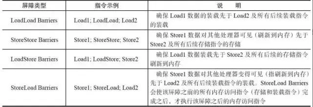

## Java-并发

### 进程、线程、锁

- 线程有用户线程和内核线程，两者的权限是不同的，且类型**不能**相互切换，当用户线程需请求某些操作时（eg: IO），需要进行用户态与内核态的切换，具体大致为（用户线程保存状态并挂起，内核线程接收传递来的状态执行，将执行的结果返回给用户线程，用户线程恢复执行）

- 线程创建方式：继承Thread类 start()方法、实现Runnable接口、实现Callable接口、线程池 注：在Java 19有加入了些新的东西，比如虚拟线程（协程）Virtual Threads、Structured Concurrency

- 池化技术：线程复用、控制最大并发数、线程管理

- 通过ThreadPoolExecutor创建线程池：几个参数：corePoolSize、maximumPoolSize、keepAliveTime、unit、workQueue、threadFactory、handler。

- 如果达到了最大线程数，且拒绝策略使用的CallerRunsPolicy，则会使用调用者线程运行新加入的任务，这样在任务执行完之前，不会再接新的任务了。

- 线程生命周期：New、Runnable（Running、Ready)、Waiting、Timed_Waiting、Blocked、Terminated

- 推荐通过Thread的interrupt()方法来主动中断线程（设置中断状态位），针对阻塞的线程，会抛出中断异常，从而退出阻塞代码。

  interrupt()：将调用该方法的对象所表示的线程标记一个中断标记，并不是真的停止该线程。

  interrupted()：获取**当前线程**的中断状态，并且会清除线程的状态标记。是一个是静态方法。

  isInterrupted()：获**取调用该方法的对象所表示的线程**的中断状态，不会清除线程的状态标记。是一个实例方法

- sleep()是Thread类中的，不释放锁。wait()与notify()是Object类中的，释放锁。await()和signal()是JUC包下的Condition中的，用于新版锁相关。

  当前线程调用condition.await()方法后，会使得当前线程释放lock然后加入到等待队列（不带头节点的链式队列）中，直至被condition.signal()/signalAll()
  后会使得当前线程从等待队列中移至到同步队列（带头节点的链式队列）中去，直到获得了lock后才会从await方法返回，或者在等待时被中断会做中断处理。也即被唤醒后要先重新获取锁。

- 锁：乐观锁（通过CAS操作实现）、悲观锁、自旋锁、Synchronized同步锁、ReentrantLock、ReadWriteLock读写锁、Semaphore信号量、CountDownLatch倒计时器、CyclicBarrier循环栅栏。
  可重入锁、公平锁、非公平锁、共享锁、独占锁、重量级锁、轻量级锁、偏向锁（已过时）、Atomic原子类

- 锁的状态总共有四种:无锁状态、偏向锁、轻量级锁和重量级锁。锁升级

- Synchronized可修饰实例方法、静态方法、代码块

- Synchronized底层原理：`synchronized` 同步语句块的实现使用的是 `monitorenter` 和 `monitorexit` 指令，其中 `monitorenter` 指令指向同步代码块的开始位置，`monitorexit` 指令则指明同步代码块的结束位置。另外需注意除了正常出口的
  monitorexit，还在异常处理代码里插入了 monitorexit。

  `synchronized` 修饰的方法并没有 `monitorenter` 指令和 `monitorexit` 指令，取得代之的确实是 `ACC_SYNCHRONIZED` 标识，该标识指明了该方法是一个同步方法。

  不过两者的本质都是对对象监视器 monitor 的获取。

  执行 `monitorenter` 指令时，线程试图获取锁也就是获取 **对象监视器 `monitor`** 的持有权，包含对锁计数器值的判断（可以结合AQS中的一起讲）

  在 Java 虚拟机(HotSpot)中，Monitor 是基于
  C++实现的，由[ObjectMonitor](https://github.com/openjdk-mirror/jdk7u-hotspot/blob/50bdefc3afe944ca74c3093e7448d6b889cd20d1/src/share/vm/runtime/objectMonitor.cpp)
  实现的。每个对象中都内置了一个 `ObjectMonitor`对象。

  另外，`wait/notify`等方法也依赖于`monitor`对象，这就是为什么只有在同步的块或者方法中才能调用`wait/notify`等方法，否则会抛出`java.lang.IllegalMonitorStateException`的异常的原因。

- `synchronized` 早期属于重量级锁，因为监视器锁（monitor）是依赖于底层的操作系统的 `Mutex Lock` （互斥锁）来实现的，Java
  的线程是映射到操作系统的原生线程之上的。如果要挂起或者唤醒一个线程，都需要操作系统帮忙完成，而操作系统实现线程之间的切换时需要从用户态转换到内核态，这个状态之间的转换需要相对比较长的时间，时间成本相对较高。

  JDK1.6 对锁的实现引入了大量的优化，如自旋锁、适应性自旋锁、锁消除、锁粗化、偏向锁、轻量级锁等技术来减少锁操作的开销。在之后推出的 Java1.7 与 1.8 中，均对该关键字的实现机理做了优化。（主体应该是通过锁升级的那一套）

- ReentantLock 继承接口 Lock 并实现了接口中定义的方法，他是一种可重入锁，除了能完成 synchronized 所能完成的所有工作外，还提供了诸如可响应中断锁、可轮询锁请求、定时锁等避免多线程死锁的方法。ReentrantLock 是 API 级别的，synchronized 是 JVM 级别的

- [ReentrantLock原理](https://www.lwohvye.com/2022/01/17/java-%e5%8f%af%e9%87%8d%e5%85%a5%e9%94%81reentrantlock%e5%ae%9e%e7%8e%b0%e5%8e%9f%e7%90%86/)
  注（riːˈɛntrənt 可重入）

- 可重入锁的实现机制：AQS、每个锁对象拥有一个使用volatile修饰的锁计数器state和一个指向持有该锁的线程的指针，当获取锁时，若锁已被本线程持有，则讲计数器加1，解锁时会减1，当变为0时表示完全释放锁。

- LockSupport是用来创建锁和其他同步类的基本线程阻塞原语。

  LockSupport中的park()和 unpark()的作用分别是阻塞线程和解除阻塞线程。

  其底层是基于Unsafe的park()和unpark()

  LockSupport类使用了一种名为Permit（许可）的概念来做到阻塞和唤醒线程的功能，每个线程都有一个许可（permit），permit只有两个值1和0，默认是0。

- [Unsafe类相关](https://www.lwohvye.com/2021/05/12/java%e5%8f%8c%e5%88%83%e5%89%91%e4%b9%8bunsafe%e7%b1%bb%e8%af%a6%e8%a7%a3%ef%bc%88%e8%bd%ac%ef%bc%89/)

- CountDownLatch 一般用于某个线程 A 等待若干个其他线程执行完任务之后，它才执行;而 CyclicBarrier 一般用于一组线程互相等待至某个状态，然后这一组线程再同时执行; 另外，CountDownLatch 是不能够重用的，而 CyclicBarrier
  是可以重用的，另外，`CyclicBarrier` 还提供一个更高级的构造函数 `CyclicBarrier(int parties, Runnable barrierAction)`
  ，用于在最后一个线程到达屏障时（算是一个优先处理逻辑，parties减到0时，执行一次，之后会将其重置，所以如果将其设置为5，然后起10个线程，就会执行两次，但不要被迷惑了），优先执行 `barrierAction`，方便处理更复杂的业务场景。这两个的底层还是await()和signal()

- volatile是JVM提供的轻量级的同步机制

    - 保证可见性

    - 不保证原子性（对++、--等操作并不是原子性的）

    - 禁止指令重排（保证有序性）

- JMM（Java内存模型Java Memory Model，简称JMM）本身是一种抽象的概念并不真实存在，它描述的是一组规则或规范，通过这组规范定义了程序中各个变量（包括实例字段，静态字段和构成数组对象的元素）的访问方式。

  JMM关于同步的规定：

    - 线程解锁前，必须把共享变量的值刷新回主内存
    - 线程加锁前，必须读取主内存的最新值到自己的工作内存
    - 加锁解锁是同一把锁

  线程对变量的操作（读取赋值等）必须在工作内存中进行，首先要将变量从主内存拷贝到自己的工作内存空间，然后对变量进行操作，操作完成后再将变量写回主内存，不能直接操作主内存中的变量，

  JMM（Java Memory Model，Java 内存模型）和 happens-before 原则

    - 规则一：程序的顺序性规则，一个线程中，按照程序的顺序，前面的操作happens-before后续的任何操作。

  对于这一点，可能会有疑问。顺序性是指，我们可以按照顺序推演程序的执行结果，但是编译器未必一定会按照这个顺序编译，但是编译器保证结果一定==顺序推演的结果。

    - 规则二：volatile规则，对一个volatile变量的写操作，happens-before后续对这个变量的读操作。

    - 规则三：传递性规则，如果A happens-before B，B happens-before C，那么A happens-before C。jdk1.5的增强就体现在这里

    - 规则四：管程中的锁规则，对一个锁的解锁操作，happens-before后续对这个锁的加锁操作。

    - 规则五：线程start()规则，主线程A启动线程B，线程B中可以看到主线程启动B之前的操作。也就是start() happens before 线程B中的操作。

    - 规则六：线程join()规则，主线程A等待子线程B完成，当子线程B执行完毕后，主线程A可以看到线程B的所有操作。也就是说，子线程B中的任意操作，happens-before join()的返回。

- 指令重排：编译器优化的重排、指令并行的重排、内存系统的重排

  单线程环境里面确保程序最终执行结果和代码顺序执行的结果一致。但多线程下可能会带来问题。

- 内存屏障（Memory Barrier）：是一个CPU指令。通过插入内存屏障禁止在内存屏障前后的指令执行重排序优化。内存屏障另外一个作用是强制刷出各种CPU的缓存数据，因此任何CPU上的线程都能读取到这些数据的最新版本。store屏障指令、load屏障指令

  

- 轻量级锁所适应的场景是线程交替执行同步块的情况，如果存在同一时间访问同一锁的情况，就会导致轻量级锁膨胀为重量级锁。

- 锁优化：减少锁持有时间、减小锁粒度、锁分离、锁粗化、锁消除

- 中断一个线程，其本意是给这个线程一个通知信号，会影响这个线程内部的一个中断标识位。这个线程本身并不会因此而改变状态(如阻塞，终止等)。

- 线程池的组成：线程池管理器、工作线程、任务接口、任务队列

- 死锁的四个条件：互斥条件、请求与保持、不剥夺、循环等待。避免死锁需要破坏上面四个之一

- 阻塞队列：add、remove、element抛异常；offer、poll、peek返回特殊值；put、take阻塞；

- ThreadLocal（线程本地存储），具体的可以再看看，包含冲突的解决等

  `Thread`类有一个类型为`ThreadLocal.ThreadLocalMap`的实例变量`threadLocals`，也就是说每个线程有一个自己的`ThreadLocalMap`。

  `ThreadLocalMap`有自己的独立实现，可以简单地将它的`key`视作`ThreadLocal`，`value`为代码中放入的值（实际上`key`并不是`ThreadLocal`
  本身，而是它的一个弱引用，主要是因为，当ThreadLocal不再被使用时，因为ThreadLocalMap中是其弱引用，所以可以被回收掉，这样Entry的key就会变成null，但因为value是强引用，虽然在一些操作时会清除key为null的Entry，还是会出现内存泄漏问题，但起码保证了在使用线程池的情况下，不会出现读取到放回池中前存的属性的问题，但还是要养成习惯，手动remove()
  清除）。

  每个线程在往`ThreadLocal`里放值的时候，都会往自己的`ThreadLocalMap`里存，读也是以`ThreadLocal`作为引用，在自己的`map`里找对应的`key`，从而实现了线程隔离。

  最常见的ThreadLocal使用场景为用来解决数据库连接、Session管理、~~还有一种不推荐的使用方式是传参数（当心被打）~~ 等。

- 并发编程的三个重要特性：原子性、可见性、有序性

- CAS(Compare And Swap/Set)比较并交换，CAS 算法的过程是这样:它包含 3 个参数 CAS(V,E,N)。V 表示要更新的变量(内存值)，E 表示预期值(旧的)，N 表示新值。当且仅当 V 的值等于 E 值时，才会将 V 的值设为 N，如果 V的 值和 E
  值不同，则说明已经有其他线程做了更新，则当前线程什么都不做。最后，CAS 返回当前 V 的真实值。然后针对ABA问题，一般采用引入版本号的方式来解决。从 Java1.5 开始 JDK 的 atomic 包里提供了一个类 AtomicStampedReference 来解决 ABA 问题。

  CAS的全称为Compare-And-Swap，它是一条CPU并发原语（多条指令原子执行）。

- AQS：AbstractQueuedSynchronizer抽象队列同步器，AQS 定义了一套多线程访问共享资源的同步器框架，许多同步类实现都依赖于它，如常用的ReentrantLock

    - AQS 核心思想是，如果被请求的共享资源空闲，则将当前请求资源的线程设置为有效的工作线程，并且将共享资源设置为锁定状态。如果被请求的共享资源被占用，那么就需要一套线程阻塞等待以及被唤醒时锁分配的机制，这个机制 AQS 是用 **CLH 队列锁**实现的，即将暂时获取不到锁的线程加入到队列中。CLH(
      Craig,Landin,and Hagersten)队列是一个虚拟的双向队列（虚拟的双向队列即不存在队列实例，仅存在结点之间的关联关系）。AQS 是将每条请求共享资源的线程封装成一个 CLH 锁队列的一个结点（Node）来实现锁的分配。

    - AQS 使用一个用volatile修饰的 int 成员变量来表示同步状态，通过内置的 FIFO 同步队列来完成获取资源线程的排队工作。AQS 使用 CAS 对该同步状态进行原子操作实现对其值的修改。

    - AQS 只是一个框架，具体资源的获取/释放方式交由自定义同步器去实现（模板方法），isHeldExclusively()、tryAcquire(int)、tryRelease(int)、tryAcquireShared(int)、tryReleaseShared(int)

- 进程调度算法：优先调度算法（先来先服务、短作业优先）、高优先权优先调度算法、基于时间片的轮询调度算法。这个更详细的在计算机基础部分。

- 不推荐在Java中使用线程组，应使用线程池。前者是为了方便线程的管理，后者是为了管理线程的生命周期，复用线程，减少创建销毁线程的开销。

- 使用ThreadPoolExecutor可以创建自定义线程池。针对异步计算结果，使用Future，调用get()阻塞的获取计算结果。线程池使用后，记得关闭

- 线程间同步/通讯：用户模式（原子操作、临界区）、内核模式（事件、信号量、互斥量）

- Java 的每个对象中都有一个锁(monitor，也可以成为监视器) 并且 wait()，notify() 等方法用于等待对象的锁或者通知其他线程对象的监视器可用。在 Java 的线程中并没有可供任何对象使用的锁和同步器。这就是为什么这些方法是 Object 类的一 部分，这样 Java
  的每一个类都有用于线程间通信的基本方法。

- 为什么 wait 和 notify 方法要在同步块中调用?

  Java API 强制要求这样做，如果你不这么做，你的代码会抛出 IllegalMonitorStateException 异常。还有一个原因是为了避免 wait 和 notify 之间产生竞态条件。由于所有的这些方法都需要线程持有对象的锁，这样就只能通过同步来实现，所以他们只能在同步方法或者同步块中被调用。

- 为什么应该在循环中检查等待条件?

  处于等待状态的线程可能会收到错误信号和伪唤醒，如果不在循环中检查等待条件，程序就会在没有满足结束条件的情况下退出。

- 使用Thread类的join()方法，可以确保本线程在所有本线程创建的线程之后结束。可以用来等待

- 静态同步方法锁类对象。非静态同步方法锁当前对象。同步块锁的是同步对象，这个可自己指定，可以是类对象、当前对象、也可以是某个变量之类的等。

- 线程类的构造方法、静态块是被 new 这个线程类所在的线程所调用的，而 run 方法里面的代码才是被线程自身所调用的。

- [JVM内部锁升级过程](https://www.lwohvye.com/2021/07/02/%e8%b0%88%e8%b0%88jvm%e5%86%85%e9%83%a8%e9%94%81%e5%8d%87%e7%ba%a7%e8%bf%87%e7%a8%8b/)
    - 对象头MarkWord。主要是包括锁类型、hashCode、分代年龄、偏向状态、锁状态。
    - 锁的类型，无锁、偏向锁、轻量级锁、重量级锁
        - 对象头信息：
        - 无锁：hashcode（默认懒加载模式，被调用时生成），分代年龄，偏向状态，锁状态
        - 偏向锁：偏向线程，偏向次数，分代年龄，偏向状态，锁状态
        - 轻量级锁：线程锁记录指针，锁状态，对象头信息迁移到锁记录中
        - 重量级锁：monitor指针，锁状态，对象头信息迁移到monitor的锁记录中。
        - gc：null，gc状态
        - 偏向锁：撤销：调用hashcode，线程切换，调用wait
        - 重偏向，以class为单位，当这个class类型的实例对象撤销达到20次后，会执行批量重偏向，执行新线程的指针
        - 批量撤销，当撤销次数达到40次后，会批量撤销偏向锁。新建的对象也不再使用偏向锁。
        - 轻量级：当出现线程切换时，偏向锁会升级为轻量级锁。
        - 重量级锁，当线程竞争时，轻量级升级为重量级锁。
        - monitor几个字段：entryList，锁竞争，经历几次cas加锁失败后，会进入entryList等待 header 记录对象头信息 hashcode 分代年龄 waitSet，线程进入调用了wait方法，释放锁后等待 owner，指向当前加锁的线程

- 锁升级过程总结：初始为biasable，首次加锁后biased。

    - 只有偏向模式下进入到偏向锁，无锁状态只能升级为轻量锁
    - 若调用wait()，则膨胀为 fat lock，之后解锁、调用notify()等，仍为fat lock（即锁不会降级）
    - 若只调用notify()，则升级为thin lock，解锁后变为non-biasable
    - 在偏向锁的状态下，发生锁的竞争时，会做偏向锁撤销，并膨胀成重量锁 fat lock
    - 在偏向锁的状态下，未发生锁的竞争时，当另一线程试图获取锁时（此时上一线程已解锁），则升级为thin lock，解锁后变为non-biasable，当未出现锁竞争时，加解锁一直在轻量与无锁间切换（同样不会降级）。
    - 另在锁升级处有讲到，当偏向某个线程，且锁已空闲，经过一段时间后，偏向锁会过期，可以进行重偏向，偏向另一线程
- 协程：协程运行在线程之上，当一个协程执行完成后，可以选择主动让出，让另一个协程运行在当前线程之上。**协程并没有增加线程数量，只是在线程的基础之上通过分时复用的方式运行多个协程**
  ，而且协程的切换在用户态完成，切换的代价比线程从用户态到内核态的代价小很多。但在协程中不能调用导致线程阻塞的操作。也就是说，协程只有和异步IO结合起来，才能发挥出更大的作用。 Java 19引入的Virtual Thread就是协程
- 各种锁（Java、Redis、ZK）底层的原理。监视器锁（monitor）是依赖于底层的操作系统的 `Mutex Lock` （互斥锁）来实现的。
- ParallelStream是并行的流，它通过Fork/Join 框架（JSR166y）来拆分任务，加速流的处理过程。ForkJoinPool来支持使用分治法(Divide-and-Conquer Algorithm)
  来解决问题，即将一个任务拆分成多个“小任务”并行计算，再把多个“小任务”的结果合并成总的计算结果。相比于ThreadPoolExecutor，ForkJoinPool能够在任务队列中不断的添加新任务，在线程执行完任务后可以再从任务列表中选择其他任务来执行；并且可以选择子任务的执行优先级，因此能够方便的执行具有父子关系的任务。
  ForkJoinPool内部维护了一个无限队列来保存需要执行的任务，而线程的数量可通过构造函数传入，线程数量默认会使用处理器数量减去1，这样做是因为还有一个主线程（提交任务的线程，**该线程也参与到任务的执行**），
  主线程加上线程池线程刚好等于cpu核心数，这样能同时跑满cpu，并且不会因为线程太多造成线程本身的切换浪费资源。但**因为主线程也参与执行任务，所以业务使用时要注意，且可能因阻塞主线程影响任务的提交效率，对于这种情况，建议不要用ParallelStream**
