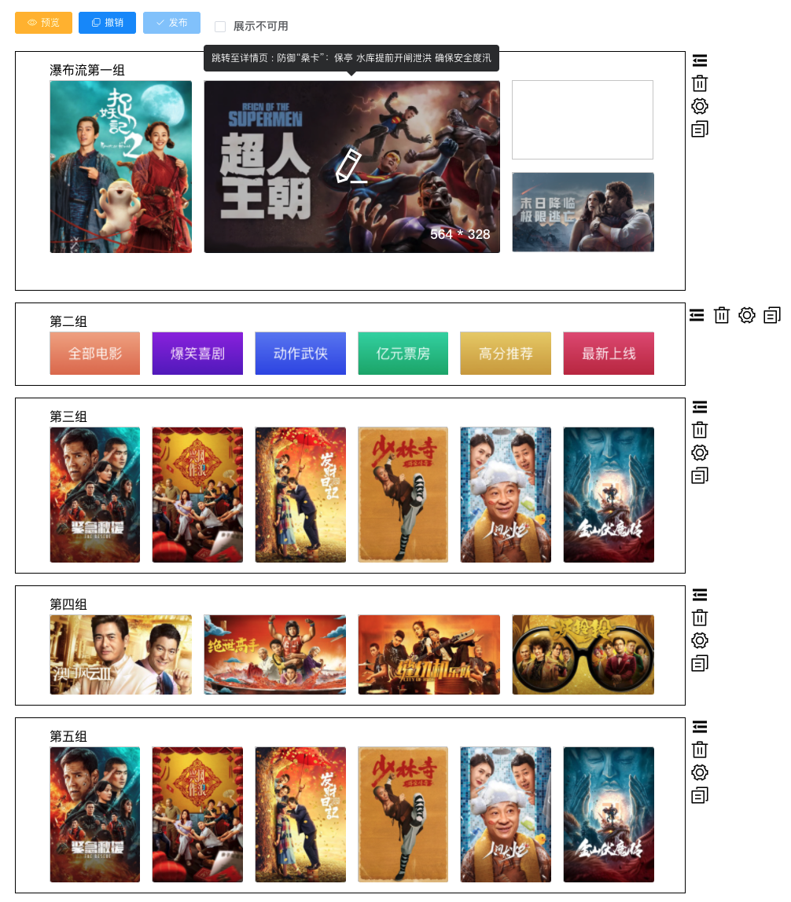
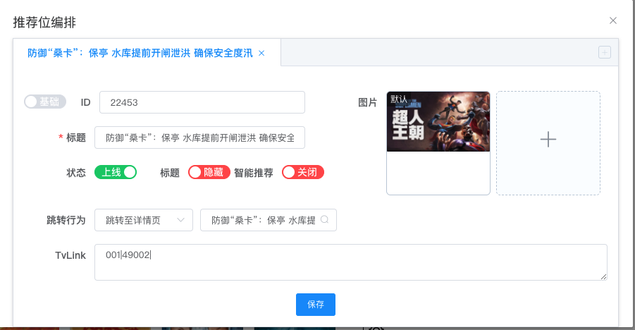
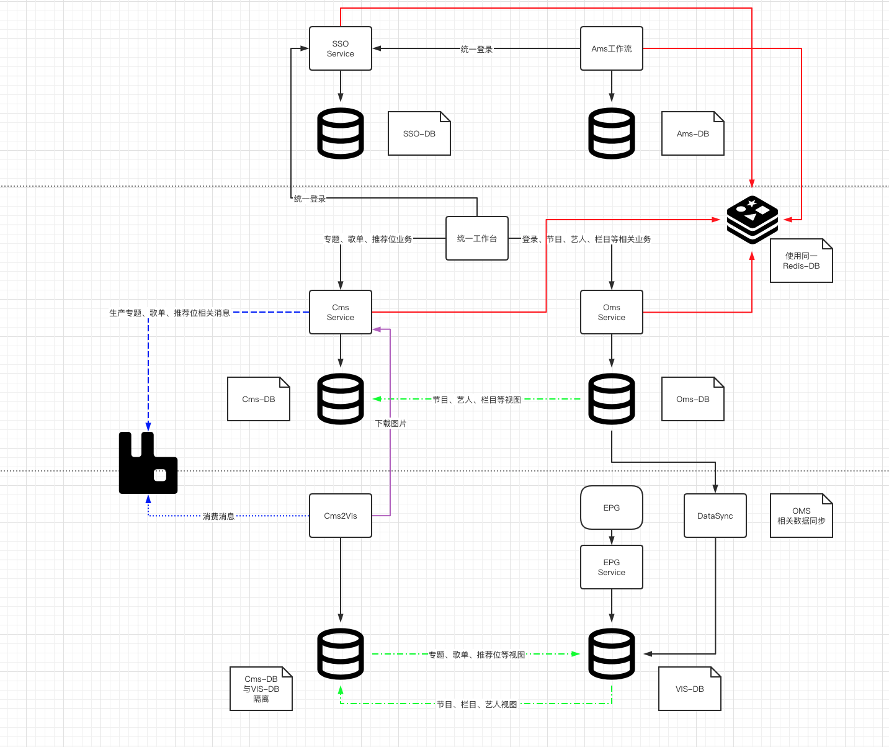

- TVlink V2.0
    - 较大的灵活性及扩展性，简化后续多变的需求
  
  ```json
  {
    "params": [
        {"component": "dialog", "entity": "media", "fill": {"0": "type", "1": "content_type"}}, 
        {"component": "select", "entity": "", "fill": {"2": "template_type"}}, 
        {"component": "input", "entity": "", "fill": {"3": "#value"}}
    ], 
     "pattern": "${0}${1}|${2}|${3}" 
  } 
  ```
- 推荐位可视化编排
    - 页面、板块、组、推荐位
    - 多版本控制，预览、发布、回退
    - 基于Canvas
    - 
    - 
- 统一工作台
    - 通过视图解决模型差异（结构、部分属性）
    - 同步程序开发。消息队列、事件通讯
    - 
