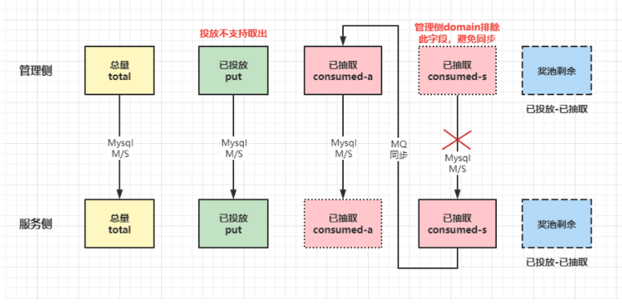
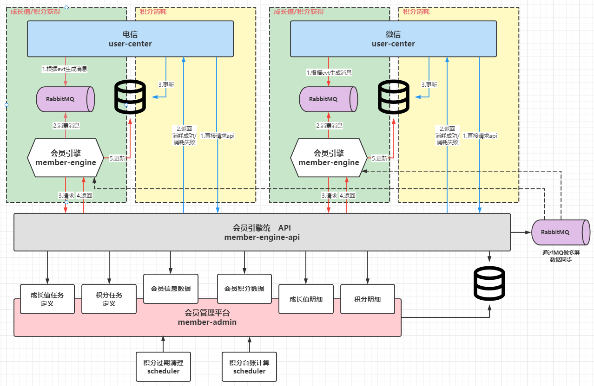

#### 资源服务重构

- 之前服务侧帮前端屏蔽了很多细节。前端对模型不是很了解
- 引用新的架构
- 开了个头，后续因为别的项目，就一直delay

#### 活动重构

- 活动模板化
- 重构的背景：原活动框架较老，维护难度较大。奖品超发/发不出去。投票排行相关设计不合理，需要专门的计票程序。
- 解决的几个问题：通过任务权益体系提高灵活性为后续的设计提供了不错的思路，权益的延迟过期，分布式锁与事务，奖品的分段派放，投票中的热key问题，
- 主体变动：
    - 使用新的架构：Spring boot + Jpa + Redis
    - 引入RabbitMQ，事件通知的方式，实现解耦（EPGService本身是多个服务的统称，事件可由其他服务产生，这种发布订阅的模式可以很好的解耦，且方便后续的扩展），同时大大提高了扩展性
    - 优化抽奖相关逻辑，解决奖品超发，上下游数据同步的问题
        - 原来只有一个剩余奖品数，管理侧和服务侧都会更新，就可能导致并发问题，另外就是主从同步，上游的修改会同步到下游，也可能导致并发问题，考虑到实效性，必须先写下游，而不是写上游然后等同步下来。
        -
      调整：设计了三个字段，主要是已投放的奖品数和已消耗的奖品数。这样剩余奖品数自己减一下就行了。上游修改已投放奖品数、下游关注已消耗奖品数。另外针对同步的问题，将已消耗奖品数设计为两个字段一个供上游修改使用，一个供下游修改使用，上游没有对服务侧的那个字段的更新动作（使用JPA时，最好是当修改某一字段而非修改整行记录），也就不会出现覆盖下游更新的问题。另使用MQ进行了解耦，下游不再连上游的库。
        - 定义：奖品总数、已投放奖品数、已消耗奖品数（管理端）、已消耗奖品数（服务端）
        - 剩余奖品数 = 已投 - 已消耗。避免投放时要更新两个字段（已投、剩余）的问题
        - 因为已消耗奖品数要从下游更新到上游，设计两个字段，一个在管理端使用，一个在服务端使用，管理端忽略服务端的字段，避免主从同步的覆盖服务侧的修改问题。两端分别使用不同的字段。
        - 奖品包含概率及数量。可以有不同的抽奖机会，不同的概率。
        - 抽奖分为摇奖、派奖两个阶段，不同阶段不同的锁，且锁的粒度和范围尽可能的小，提高性能。
        - 摇奖阶段锁 用户，所以不同的用户可以同时摇奖。若未中奖，则记录抽奖结果，返回，结束；若中奖，则进入派奖阶段
        - 派奖阶段锁 奖品（不同的奖品不同的锁），所以不同的奖品可并行派发。若奖品数量不足，则视为未中奖。针对低价值的奖品，可以设置分段锁，提高并发性。
        - 运营可在管理端调整奖品数量，这里同样对奖品加锁（修改那种奖品锁哪种），所以修改可能失败，并且加锁后，修改前要确定当前剩余量（check下游的），若不足则可能失败。
        - 
    - 抽象任务-权益体系，定义统一框架，管理用户行为和获得权益的模式
        - 通过事件驱动任务的完成。通过完成任务来获取权益。通过调整任务来调整权益的发放方式。
        - 后续在用户中心，对该体系做了进一步扩展，将会员的成长值、积分、及达到等级奖励等都通过该体系实现
    - 投票排行相关：
        - 早期为投票记录表及计票定时任务，处理并发情况下多次投票等问题
        - 活动机会统一抽象为获取、锁定、消耗几个步骤，减小锁粒度（活动-用户），保证线程安全的情况下，又没有对性能产生太大的影响
        - 采用Redis的ZSet进行投票、排行，通过lua脚本完成票数的更新（原子性，虽可通过zinc来更新分数，但当初面临些初始化的问题，初期与对象的创建侧未完全打通，且有基础得票数，需要lua的比较更新的动作，完全重构后就不需要了）
        - 投票信息视情况落库，定时分表（历史数据归档）
        - 遗留问题：投票对象可以在C端及管理端创建，在这些端支持前，只能更新得票数时，判断是否在Redis中，并放进去（上面的lua）。
        - 投票分组，一组的数据量不会特别多
        - 根据选手的编号，取模后放到不同的key中，避免热key问题，当前是10个key。排行榜为前100，所以每个取前100做聚合即可，5分钟更新一次排行榜
        - 选手的基本信息及得票排名以Map的形式存储，也会分多个key，按投票编号，固定数目的投票对象一组（如果是支持活动中新加入的话，key会越来越多），单个选手的排名定时更新，存在滞后性，投票界面分页加载，所以会再以页纬度做缓存（失效较快），所以前几组热度会很高
    - 活动模板化开发，提高整体开发效率，增强活动的生产上线效率（后续）
- 业务抽象，统一封装
    - 活动机会统一通过任务获取
    - 几类活动流程统一抽象为：锁定活动机会、具体业务逻辑、消耗活动机会几个阶段，每个阶段都包含加解锁，且将锁定义为 活动标识_用户标识，减少了锁的持有时间，提高性能。
    - 统一封装锁定、消耗的流程
        - 使用分布式锁，当在事务中加锁/解锁时，出现了线程同步问题，在解锁后、事务提交前。解决方案：将同步代码放入独立的事务中（事务传播行为设置为REQUIRES_NEW），但当逻辑有异常时，要进行相关补偿（不是同一个事物，不会一起回滚）
    - 活动机会的过期采用获取延迟过期方案，获取剩余时再处理（避免凌晨统一处理的延迟等问题），处理后设置标记，每天只处理一次（这个标记可以用普通的key，也可以以天为纬度使用hash，因为需要设置当个key的过期，使用Redisson也许更好一些）
    - 设计：活动参与相关表每次结束后统一归档。（参与包括投票信息、闯关信息、抽奖信息），部分数据也有考虑不落库，只存在redis中
- 其他
    - 采用分布式锁，多实例部署
    - 使用sharding-jdbc做读写分离，暂无分库分表的需求
    - 使用Redisson多数据源，使用RedisTemplate也能实现，但不够灵活
    - 排行榜需要些考量，十万用户，只有前1千名有排行，后面的只有百分比，如何设计？[这里有一个方案](../extra/question.md)

#### 用户中心重构

- 重构背景：大屏为专网、小屏为公网，之间的网络未完全打通。原有的部分设计无法满足之后的需求。
- 主体变动：
    - 第一版：用户中心重构
        - Person概念（后改为Member）、TV_User、Mobile_User
        - 会员是一个抽象的人的概念，承载基本信息、积分等属性，一个人可以有大屏账号、小屏账号
        - 大小屏可以绑定/解绑，绑定前两屏有各自的Person（两端创建，使用code作为唯一标识），绑定后大屏的合并到小屏中。后续解绑大屏要与原来的Person重新关联
        - 一对一的关系，一般各自添加一个字段。一对多的关系，一般在多方加个字段。多对的关系，使用关联表。
        - 大屏有户/家庭的属性，所以一个大屏可绑定多个小屏，其中一个为主账号，参与相关业务。
        - 积分转移：绑定后大屏积分转移到小屏，后续解绑时，大屏初始积分为0
        - 数据同步：Person、TV_User、Mobile_User、Profile信息、积分信息
        - 事件同步：关注/取消关注事件、绑定/解绑事件
        - 两端部署，需要根据所处的端，监听不同的队列（SpEL）

    - 第二版：会员系统重构
        - 会员、成长值、积分、其他权益
        - 会员有Vip标识（只于付费档次有关），不同的Vip有专属权益
        - 成长值影响会员等级，不同等级也有不同的权益。前期不会降，后期会定期评估。
        - 积分、活动机会、优惠券、其他实体，都属于权益
        - 积分会过期，优先使用即将到期的权益
        - 可用积分表、积分明细表、积分历史表 各自的职能
        - 
        - 这里做的复杂，主要还是几处网络未完全打通，否则通过分库（视情况分表），能够在满足并发要求的同时，大大降低系统的复杂性
          - 很多资源通过 用户/会员 纬度的分布式锁，就可以保证线程安全，且锁的粒度足够的细
          - 不再需要很多数据同步及事件同步的逻辑。但因为走主从同步，需要考虑延迟带来的可能的问题
          - 分布式锁与事务的问题需解决：解锁后，事务提交前，可能出现问题，可考虑独立事务，但又要处理补偿
