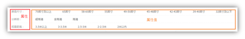
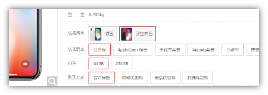
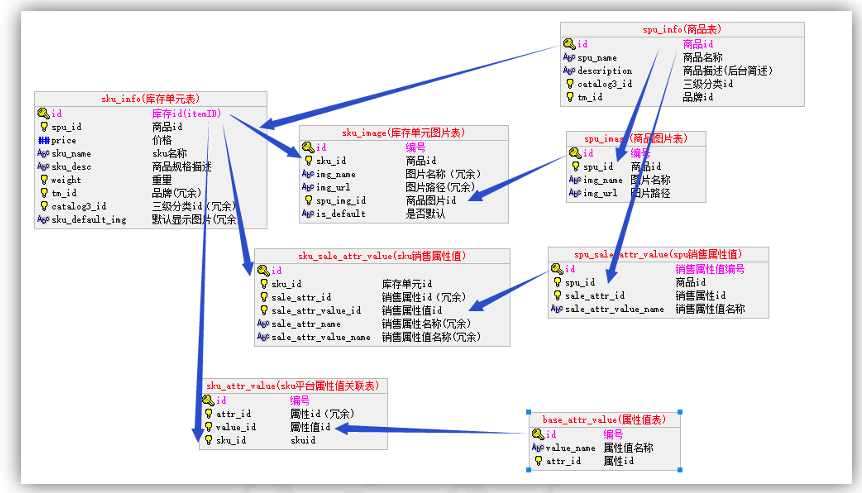
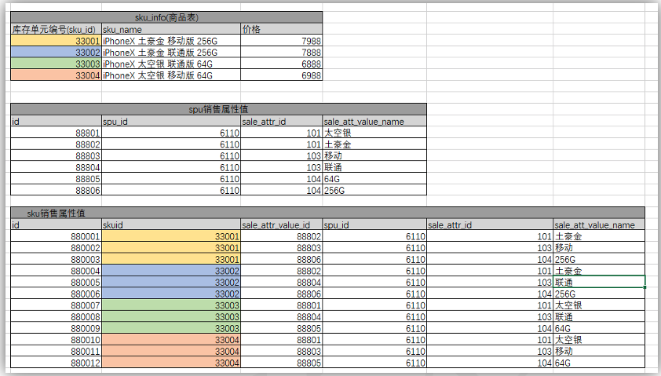
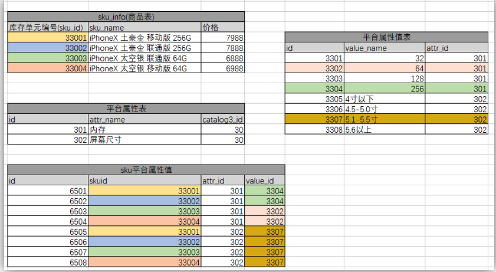
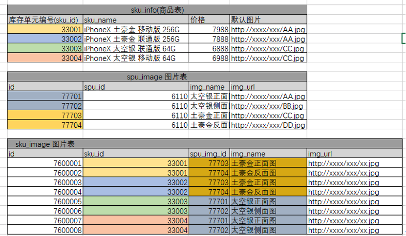

- 平台商品一般是三级分类，比如家用电器是一级分类，电视是二级分类，超薄电视就是三级分类
- 平台属性和平台属性值主要用于商品的检索，每个三级分类对应的属性都不同，类似于条件的属性

- 基本信息-销售属性：销售属性就是商品详情页右边，可以通过销售属性来定位一组spu下的哪款sku，一般每种商品的销售属性不会太多，大约1~4种，
比如：颜色、尺寸、版本、套装等等，不同销售属性的组合也就构成了一个spu下多个sku的结构

- SPU(Standard Product Unit)：标准化产品单元。是商品信息聚合的最小单位，是一组可复用、易检索的标准化信息的集合，该集合描述了一个产品的特性。
- SKU=Stock Keeping Unit（库存量单位）。即库存进出计量的基本单元，可以是以件，盒，托盘等为单位。SKU这是对于大型连锁超市DC（配送中心）物流管理的一个必要的方法。现在已经被引申为产品统一编号的简称，每种产品均对应有唯一的SKU号。
- HUAWEI Mate 60是一个SPU，HUAWEI MAte 60 白色-512G则是一个SKU
- 表结构 
- 数据示例   
